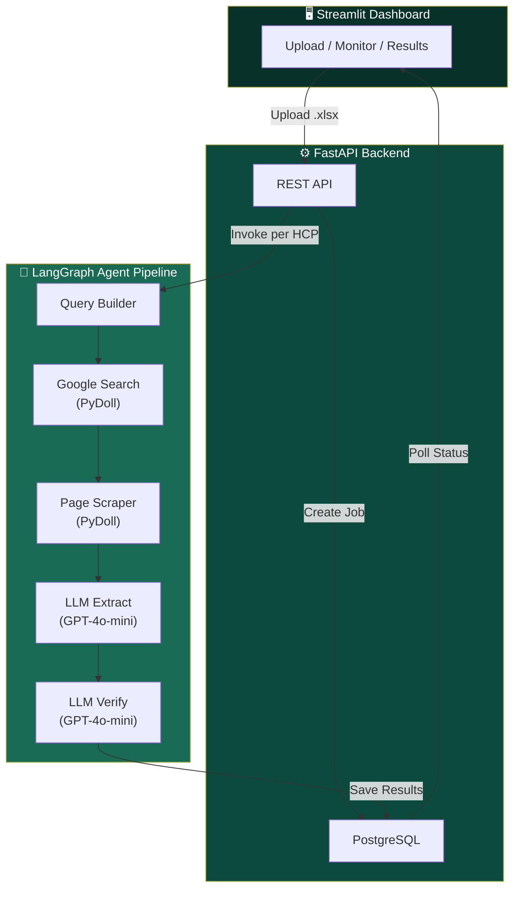
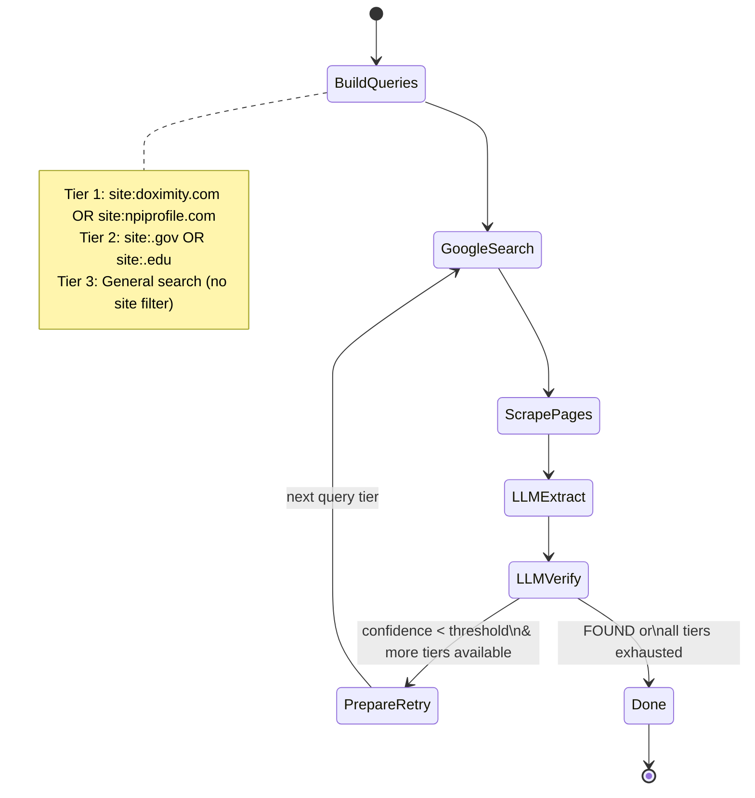
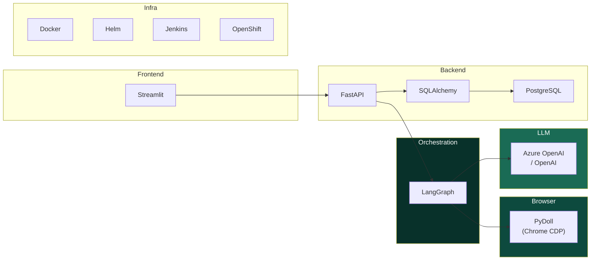

# Boehringer Ingelheim — HCP Web Crawler AI Agent

> **AI-powered Healthcare Provider contact discovery from the open internet.**
> Upload an Excel sheet of HCP records → the AI agent autonomously searches, extracts, verifies, and records contact details with source URLs for compliance.

---

## ✨ Key Features

| Feature | Description |
|---|---|
| **Agentic Search** | LangGraph-orchestrated pipeline with multi-tier query strategy and conditional retry |
| **Stealth Browsing** | PyDoll headless Chrome with human-like typing, evasion, and resource blocking |
| **LLM Extraction** | GPT-4o-mini powered contact extraction + identity verification with confidence scoring |
| **Compliance** | Source URLs recorded for every data point |
| **Real-time Monitor** | Live progress tracking via Streamlit dashboard |
| **Enterprise Ready** | PostgreSQL, Docker, Helm charts, Jenkins CI/CD, OpenShift deployment |

---

## 🏗️ System Architecture



---

## 🔄 Agent Workflow

Each HCP record flows through a **6-node LangGraph state machine** with conditional retry across 3 query tiers:



### What Happens at Each Node

| Node | Technology | What It Does |
|---|---|---|
| **BuildQueries** | Python | Constructs 3 tiered Google queries from HCP name + location |
| **GoogleSearch** | PyDoll (Chrome CDP) | Opens headless Chrome, types query, parses result links |
| **ScrapePages** | PyDoll (Chrome CDP) | Visits top 5 URLs, blocks images/CSS, extracts raw text |
| **LLMExtract** | Azure OpenAI / OpenAI | Extracts phone, email, address from raw page text |
| **LLMVerify** | Azure OpenAI / OpenAI | Verifies identity match → confidence score (0-100) |
| **PrepareRetry** | Python | Advances to next query tier if confidence < threshold |

---

## 🧰 Technology Stack



| Layer | Choice | Why |
|---|---|---|
| Agent Orchestration | **LangGraph** | Production-grade stateful graphs, checkpointing, conditional branching |
| Browser Automation | **PyDoll** | CDP-native, no WebDriver, async, evasion-first |
| LLM | **Azure OpenAI / OpenAI** | Dual provider support, GPT-4o-mini for cost-efficiency |
| Backend | **FastAPI** | Async-native, Pydantic integration, auto-docs |
| Database | **PostgreSQL** | Production-grade, async via `asyncpg` |
| Frontend | **Streamlit** | Rapid dashboard with custom CSS |
| Package Manager | **UV** | 10-100x faster than pip |
| Deploy | **Docker + Helm + Jenkins** | Enterprise CI/CD to OpenShift |

---

## 🚀 Quick Start (Single Command)

```bash
# Clone
git clone https://github.com/bokey007/HCP_web_crawller.git
cd HCP_web_crawller

# Run everything
./start.sh
```

The startup script handles all 6 steps automatically:

| Step | What It Does |
|---|---|
| 1 | Kills any existing API/UI processes |
| 2 | Checks for `uv`, installs if missing, creates virtualenv |
| 3 | Starts PostgreSQL via `docker compose up -d` |
| 4 | Creates `.env` from `.env.example` if missing |
| 5 | Generates sample Excel with real HCP records |
| 6 | Starts FastAPI (port 8000) + Streamlit (port 8501) |

> **Dashboard:** http://localhost:8501  
> **API Docs:** http://localhost:8000/docs  
> **Health:** http://localhost:8000/api/v1/health

Press `Ctrl+C` to cleanly shut down all services.

---

## 🛠️ Manual Setup (Step-by-Step)

### Prerequisites

- Python 3.12+
- Docker (for PostgreSQL)
- Google Chrome / Chromium (for PyDoll)
- An OpenAI or Azure OpenAI API key

### 1. Install Dependencies

```bash
pip install uv
uv sync --all-extras
```

### 2. Start PostgreSQL

```bash
docker compose up -d
```

### 3. Configure Environment

```bash
cp .env.example .env
```

Edit `.env` and set your LLM credentials:

```dotenv
# Choose provider
LLM_PROVIDER=openai              # or "azure_openai"

# OpenAI
OPENAI_API_KEY=sk-proj-...
OPENAI_MODEL=gpt-4o-mini

# Azure OpenAI (if using azure_openai)
AZURE_OPENAI_ENDPOINT=https://your-resource.openai.azure.com/
AZURE_OPENAI_API_KEY=your-key
AZURE_OPENAI_DEPLOYMENT=gpt-4o-mini
```

### 4. Generate Sample Data

```bash
uv run python sample_data/create_sample.py
```

### 5. Start Backend

```bash
uv run uvicorn hcp_crawler.main:app --host 0.0.0.0 --port 8000 --reload
```

### 6. Start Frontend

```bash
uv run streamlit run frontend/app.py --server.port 8501 --server.headless true
```

### 7. Run Tests

```bash
uv run pytest tests/ -v
```

---

## 📁 Project Structure

```
HCP_web_crawller/
├── src/hcp_crawler/
│   ├── main.py                    # FastAPI app with lifespan events
│   ├── config.py                  # pydantic-settings (env-driven config)
│   ├── api/
│   │   └── routes.py              # REST endpoints (upload, jobs, results, export, stats)
│   ├── models/
│   │   ├── schemas.py             # Pydantic I/O models
│   │   └── database.py            # SQLAlchemy ORM (ProcessingJob, HCPRecord)
│   ├── db/
│   │   └── session.py             # Async engine + session factory
│   ├── services/
│   │   ├── excel_service.py       # Excel parsing (openpyxl)
│   │   ├── search_service.py      # Query builder + URL ranking
│   │   ├── scraper_service.py     # PyDoll browser pool + Google parser
│   │   ├── llm_service.py         # LLM extraction + verification
│   │   ├── stats_service.py       # Impact metrics calculator
│   │   └── agent/
│   │       ├── state.py           # LangGraph TypedDict state schema
│   │       ├── nodes.py           # 6 async pipeline nodes
│   │       └── graph.py           # StateGraph definition + compilation
│   └── utils/
│       └── logger.py              # Structured logging (structlog)
├── frontend/
│   └── app.py                     # Streamlit dashboard (BI branded)
├── tests/
│   ├── test_excel_service.py      # 6 tests
│   ├── test_search_service.py     # 9 tests
│   ├── test_llm_service.py        # 6 tests
│   └── test_api.py                # 4 tests (+ async DB fixtures)
├── helm/                          # Kubernetes / OpenShift deployment
│   ├── Chart.yaml
│   ├── values.yaml
│   └── templates/
│       ├── deployment.yaml        # API + UI sidecar pods
│       ├── service.yaml           # ClusterIP service
│       ├── configmap.yaml         # Non-sensitive config
│       └── ingress.yaml           # OpenShift Routes (TLS)
├── docker-compose.yml             # Local PostgreSQL
├── Dockerfile                     # Multi-stage (UV + Chromium)
├── Jenkinsfile                    # CI/CD pipeline
├── start.sh                       # One-command launcher
├── pyproject.toml                 # UV/pip dependencies
└── .env.example                   # Environment template
```

---

## 🔧 Configuration Reference

All settings are loaded from `.env` via `pydantic-settings`:

| Variable | Default | Description |
|---|---|---|
| `LLM_PROVIDER` | `azure_openai` | `azure_openai` or `openai` |
| `OPENAI_API_KEY` | — | OpenAI API key |
| `OPENAI_MODEL` | `gpt-4o-mini` | Model to use |
| `AZURE_OPENAI_ENDPOINT` | — | Azure endpoint URL |
| `AZURE_OPENAI_API_KEY` | — | Azure API key |
| `AZURE_OPENAI_DEPLOYMENT` | `gpt-4o-mini` | Azure deployment name |
| `DATABASE_URL` | `postgresql+asyncpg://...` | Database connection string |
| `MAX_CONCURRENT_BROWSERS` | `3` | Simultaneous PyDoll instances |
| `MAX_RESULTS_PER_HCP` | `5` | Google results to check per query |
| `CONFIDENCE_THRESHOLD` | `70` | Min score to mark as FOUND (0-100) |
| `SEARCH_TIMEOUT_SECONDS` | `30` | Google search timeout |
| `PAGE_LOAD_TIMEOUT_SECONDS` | `15` | Page scraping timeout |
| `MANUAL_MINUTES_PER_RECORD` | `15` | For "hours saved" metric |
| `HOURLY_RATE_USD` | `50` | For "dollars saved" metric |

---

## 🐳 Production Deployment

### Docker

```bash
docker build -t hcp-web-crawler:latest .
docker run -p 8000:8000 -p 8501:8501 --env-file .env hcp-web-crawler:latest
```

### Helm (OpenShift / Kubernetes)

```bash
# Create secret with API keys
kubectl create secret generic hcp-crawler-secrets \
  --from-literal=OPENAI_API_KEY=sk-proj-... \
  --from-literal=DATABASE_URL=postgresql+asyncpg://...

# Deploy
helm install hcp-crawler ./helm \
  --set image.repository=your-registry/hcp-web-crawler \
  --set image.tag=latest
```

### Jenkins CI/CD

The included `Jenkinsfile` automates:
1. **Lint** — `ruff check`
2. **Test** — `pytest` with coverage
3. **Build** — Docker image
4. **Push** — To container registry
5. **Deploy** — Helm upgrade to OpenShift

---

## 📊 Dashboard KPIs

The Streamlit dashboard tracks these impact metrics in real-time:

| Metric | Formula |
|---|---|
| **Records Processed** | Total HCPs processed across all jobs |
| **HCPs Found** | Records with confidence ≥ threshold |
| **Success Rate** | Found / Total × 100% |
| **Hours Saved** | Records × 15 min ÷ 60 |
| **Dollars Saved** | Hours Saved × $50/hr |

---

## 🔒 Compliance & Data Sources

The agent prioritizes trusted, publicly accessible sources:

| Priority | Source | Examples |
|---|---|---|
| 🥇 Tier 1 | Medical directories | doximity.com, npiprofile.com |
| 🥈 Tier 2 | Government / Education | .gov, .edu domains |
| 🥉 Tier 3 | General web | Hospital sites, health directories |
| 🚫 Blocked | Social media | Facebook, Twitter, LinkedIn, Instagram |

Every extracted data point includes the source URL for full audit traceability.

---

## 📄 License

Internal use — Boehringer Ingelheim.
